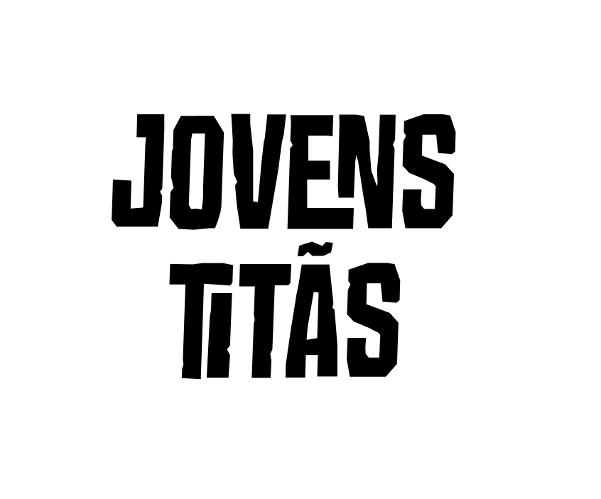

 

  
  <h6>Keywords: Projeto Integrado - Equipe Os Jovens Titans - Sistemas e Mídias Digitais - Universidade Federal do Ceará</h6>

  

  
<h4>
  Sumário: 
 <a href="#sobre">Sobre</a> • 
 <a href="#equipe">Equipe</a> • 
 <a href="#license">Licença</a> • 
 <a href="#professores">Professores</a> •
  <a href="#requisitos">Requisitos Funcionais</a> •
 <a href="#documento">Relatório e Apresentação</a>
</h4>

 
<h1>Projeto ainda em desenvolvimento, portanto acrescentaremos mais funcionalidades e a maioria das coisas que prototipamos ou codificamos até aqui ainda o poderá sofrer atualizações.</h1>
 

## :computer: Sobre

Esse repositório foi criado com o objetivo de armazenar o projeto da disciplina projeto integrado 1 do curso de Sistemas e Mídias Digitais. O projeto 
em questão propõe uma solução facil para um problema que envolve a nosso curso, no qual o discente é aconselhado no 5 semestre a seguir um roteiro de cadeiras dependendo da área de interesse(Design interativo, Animação e audiovisual, Sistemas Multimídia, Jogos Digitais), entretando não se tinha até então algo que ajudasse
o aluno a saber qual cadeira devesse escolher, então direcionando ao que foi proposto pelo nosso cliente, criamos um sistema que ajuda o aluno a escolher ....

## :busts_in_silhouette: Equipe: Os Jovens Titans

|  NOME                                  |  FUNÇÃO                    |
|  ----------------------------          |  --------------------------|
|   Maisa Lourenço dos Santos            |  Líder e Design            | 
|   Deivid Mota Freitas                  |  Design                    |
|   Lia Fernanda Rodriges da Silva       |  Design                    |
|   Jackson Pontes Cavalcante Filho      |  Programador               |
|   Francisco Gustavo Cassimiro Ferreira |  Programador               |

## 	:woman_teacher: :man_teacher: Professores
|  DOCENTES                                        |
|  ----------------------------                    |  
|   Wellington Vagner Ferreira Sarmento            |  
|   Cátia Luzia Oliveira da Silva                  | 

## :dart: Requisitos funcionais

|  Código                           |  Descrição                    |  Codificação  | Status | 
|  ----------------------------     | ----------------------------  | ------------  | ------ |
|  RFG0001                          |  Cadastrar usuário            | Em breve      |        |
|  RFG0002                          |  Autenticação e Login         | Em breve      |        |
|  RFG0003                          |  Mostrar lista de trilhas     | Em breve      |        |
|  RFG0004                          |  Mostrar lista de disciplinas | Em breve      |        |

## :memo: Licença
Este código está sobre a licença GNU GPL 3.0. Para mais informações, veja o [LICENSE](https://github.com/GustavoCassimiro9/ProjetoIntegrado1-SMD-OsJovensTitans/blob/main/LICENSE).

## :clipboard: Relatório

O relatório completo sobre o processo de desenvolvimento dessa aplicação pode ser encontrado em: https://docs.google.com/document/d/1FwiaD9JFk8mSxn4_g5lY3PSJYfsE76G6rsW6UmTRpKo/edit

